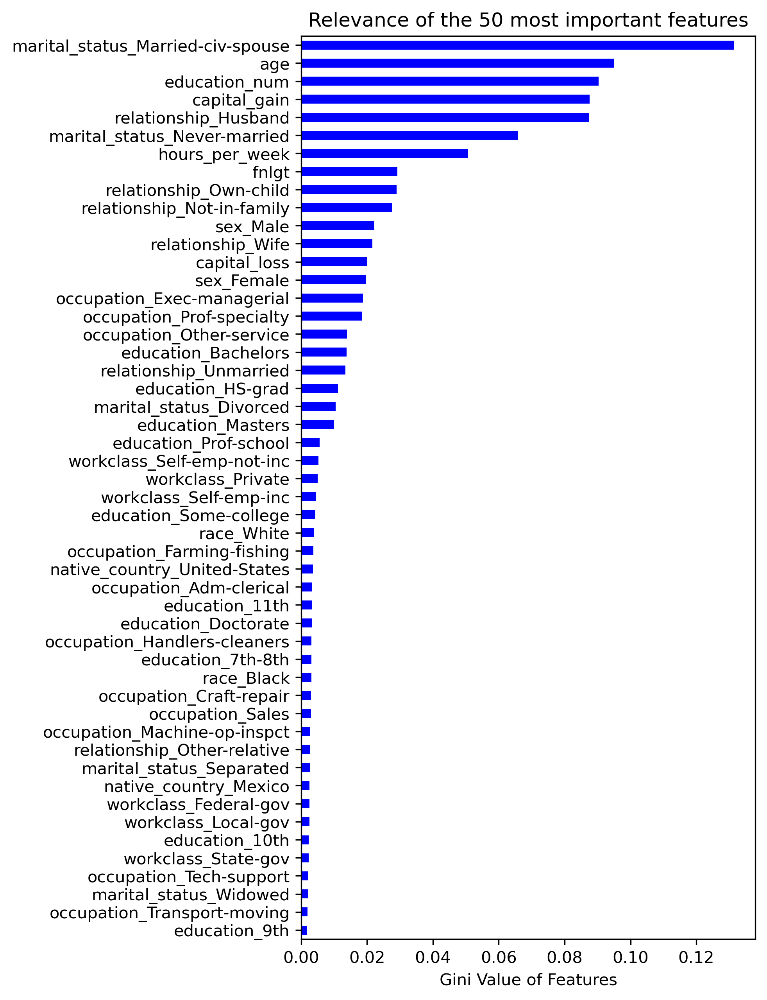
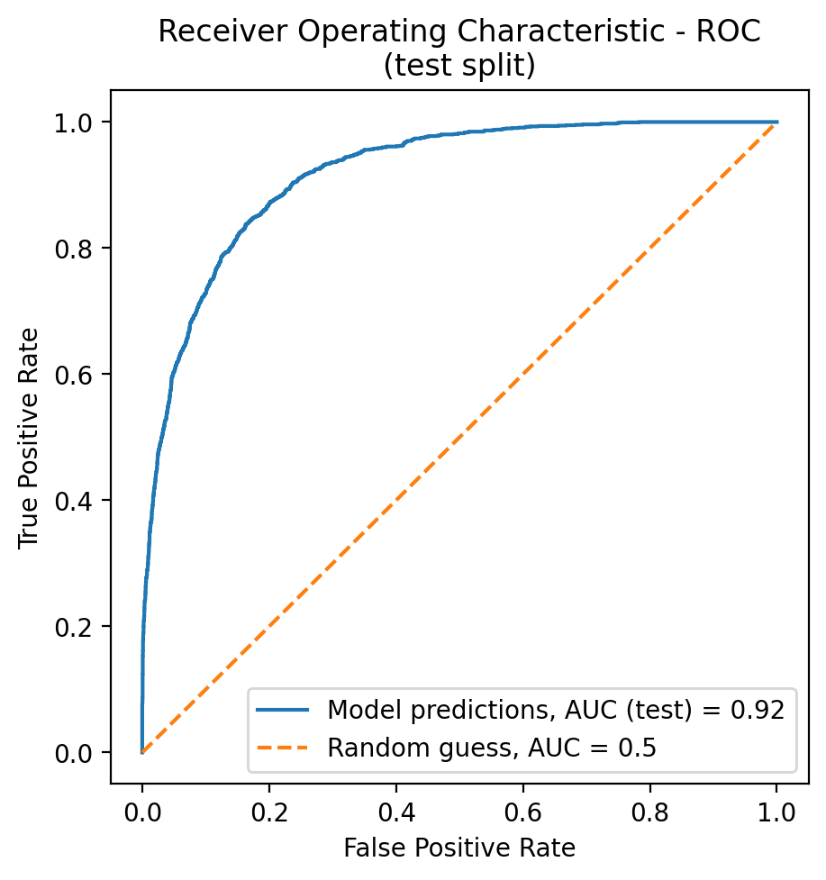

# Census-Salary Dataset: Model Card

A simple census dataset is used to train an inference pipeline consisting of a random forest classifier (Scikit-Learn version 1.20.0). The dataset is composed of 32,561 entries of different people, each with 15 columns (age, education, etc.).

Table of contents:
- [Census-Salary Dataset: Model Card](#census-salary-dataset-model-card)
  - [Dataset](#dataset)
  - [Model Details](#model-details)
  - [Intended Use](#intended-use)
  - [Training Data](#training-data)
  - [Evaluation Data](#evaluation-data)
  - [Metrics](#metrics)
  - [Ethical Considerations](#ethical-considerations)
  - [Caveats and Recommendations](#caveats-and-recommendations)

## Dataset

The dataset was obtained from the [this Udacity repository](https://github.com/udacity/nd0821-c3-starter-code/tree/master/starter/data).

As specified in the [`config.yaml`](config.yaml) configuration file, we have 14 features, which are divided in numerical and categorical:

```yaml
numerical:
- "age"
- "fnlgt"
- "education_num"
- "capital_gain"
- "capital_loss"
- "hours_per_week"
categorical:
- "workclass"
- "education"
- "marital_status"
- "occupation"
- "relationship"
- "race"
- "sex"
- "native_country"
```

The target variable is the `salary` value, which is binary: `<=50K` or `>50K`.

The raw dataset is preprocessed with the following steps:

- Duplicates are dropped.
- Column names are renamed, removing blank spaces and replacing `-` with `_`.

## Model Details

The chosen model is a [random forest classifier](https://scikit-learn.org/stable/modules/generated/sklearn.ensemble.RandomForestClassifier.html) due to its good performance with such tabular datasets, as reported in the literature.

The initial/default parameters of the model are defined in [`config.yaml`](config.yaml); additionally, it is trained using a grid search, which is parametrized in [`config.yaml`](config.yaml), as well. These are the hyperparameters tested in the grid search:

```yaml
n_estimators:
    - 100
    - 150
    - 200
max_features:
    - "sqrt"
    - "log2"
criterion:
    - "gini"
    - "entropy"
max_depth:
    - 5
    - 10
    - 15
```

The best model has the following hyperperameters, reported in the automatically generated file [`./exported_artifacts/evaluation_report.txt`](./exported_artifacts/evaluation_report.txt):

```python
{'criterion': 'gini', 'max_depth': 15, 'max_features': 'sqrt', 'n_estimators': 200}
```

The following figure shows the Gini values of the 50 most relevant features (using the best model):

<p align="center">
  
</p>

## Intended Use

The goal of this repository/model is:

- to build a pipeline able to predict the salary range given a census entry with 14 features
- and to show how such a tabular model can be deployed to a cloud platform.

All in all, one could say that the intended use is educational, rather than commercial.

## Training Data

The training data was taken from the link provided in the [Dataset](#dataset) section. Using the train/test split functionality from Scikit-Learn, and with a fixed random seed, all the rows are reduced to 80% of the entries.

## Evaluation Data

The evaluation data is the test split complementary to the [Training Data](#training-data).

## Metrics

The grid search is performed with a cross-validation of 3 splits using `F1` as the scoring criterion. The best model has the following score on the train split:

    F1 = 0.68

The test split produces the following scores:

    Precision = 0.57
    Recall = 0.87
    F1 = 0.69

All these metrics are persisted in the automatically generated file [`./exported_artifacts/evaluation_report.txt`](./exported_artifacts/evaluation_report.txt).

**Data splicing** is applied on all features; numerical columns are sliced at the median (equal or above, below) and categorical columns are sliced at each category. The automatically generated file [`./exported_artifacts/slice_report.txt`](./exported_artifacts/slice_report.txt).

Finally, the following figure shows the ROC curve of the model using the test split:

<p align="center">
  
</p>

## Ethical Considerations


## Caveats and Recommendations


